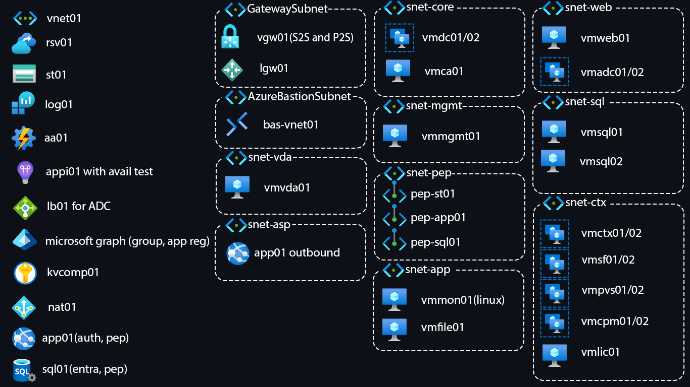

# Introduction
This repository contains *Infrastructure-as-Code (IaC)* templates that declaratively define Azure infrastructure.  
The templates are written in [Bicep](https://github.com/Azure/bicep) and can be deployed either manually or in a CI/CD pipeline.

<br>

# Getting Started

## Prerequisites
In order to install the required prerequisites, run the following commands:
```powershell
winget install Microsoft.PowerShell
winget install Microsoft.AzureCLI
```

<br>

In order to create a service connection, go to:  
[Azure DevOps](https://dev.azure.com/) → *Organization* → *Project* → Project settings → Service connections → Create service connection → Azure Resource Manager → Next → Service principal (automatic) → Next

Enter the following details and click Save:  
|                          |                |
| ------------------------ | -------------- |
| Scope level:             | Subscription   |
| Subscription:            | *Subscription* |
| Service connection name: | *Environment*  |


<br>

In order to import the pipeline, go to:  
[Azure DevOps](https://dev.azure.com/) → *Organization* → *Project* → Pipelines → New pipeline → Azure Repos Git → *Repository* → Existing Azure Pipelines YAML file → /ci/azure-pipelines.yml → Continue → Run

<br>

## IaC
The deployment uses [main.bicep](/iac/main.bicep) as its entry point, which in turn references the other Bicep files defined in the [modules](/iac/modules/) directory.

In addition to the Bicep files, there are configuration files in the [config](/iac/config/) directory and parameter files in the [parameters](/iac/parameters/) directory.  
The `.parameters.json` files contain template parameters, whereas the `.config.json` files store script variables.  
Each environment has its own set of configuration files that will apply only to that environment.

<br>

## Deployment script
The PowerShell script [deploy.ps1](/iac/deploy.ps1) is used both to validate the templates and to start an actual deployment.

<br>

In order to manually validate the templates, run the following commands:
```powershell
Set-Location iac/
./deploy.ps1 test -Validate
```

<br>

In order to manually start a deployment, run the following commands:
```powershell
Set-Location iac/
./deploy.ps1 test
```

<br>

While manual deployments are acceptable to the `test` environment, all deployments to `prod` should be run in the Azure DevOps pipeline.

<br>

## CI/CD
The Azure DevOps pipeline [azure-pipelines.yml](ci/azure-pipelines.yml) is configured to automatically trigger on pushes to the `main` branch.

The pipeline consists of an initial `Build` stage, which will validate the templates and run a what-if deployment.  
If the validation succeeds, the pipeline will continue to deploy the infrastructure to the `test` environment, followed by `prod`.

Approvals are configured for each environment, which means that the pipeline will pause and await an approval before continuing to the next stage.

Deployments to the `test` environment are allowed from any branch, whereas deployments to `prod` must be run from the `main` branch.

The required access to Azure is granted to the pipeline by means of Azure DevOps service connections created at the project-level.

<br>

In order to manually run the pipeline, go to:

[Azure DevOps](https://dev.azure.com/) → *Organization* → *Project* → Pipelines → *Pipeline* → Run pipeline → Run

<br>

## Branching strategy
Pushes directly to the `main` branch are blocked by policy.  
Instead, all changes should be implemented in feature branches and then merged into `main` using pull requests.