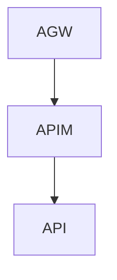

### Debug your APIs using request tracing
```powershell
#https://learn.microsoft.com/en-us/azure/api-management/api-management-howto-api-inspector
$Token = az account get-access-token --query accessToken --output tsv
$URL = " https://management.azure.com/subscriptions/xyz/resourceGroups/rg-apim-dev-01/providers/Microsoft.ApiManagement/service/apim-dev-01/gateways/managed/listDebugCredentials?api-version=2023-05-01-preview"
$headers = @{
    "Authorization" = "Bearer $Token"
    "Content-type"  = "application/json"
}
$body = ConvertTo-Json @{
    apiId    = "/subscriptions/xyz/resourceGroups/rg-apim-dev-01/providers/Microsoft.ApiManagement/service/apim-dev-01/apis/my-api"
    purposes = @("tracing")
}
(Invoke-RestMethod -Method POST -URI $URL -Headers $headers -Body $body) | ConvertTo-Json
```

In APIM add header
`Apim-Debug-Authorization: "aid=..."`
### Export open api documentation
`/subscriptions/xyz/resourceGroups/rg-apim-dev-01/providers/Microsoft.ApiManagement/service/apim-dev-01/apis/bolagsverket-api?export=true&format=openapi&api-version=2023-05-01-preview`

Api Management must be reader to get open api documentation
#### Policy for api endpoint
```xml
<policies>
    <inbound>
        <base />
        <send-request mode="new" response-variable-name="result" timeout="60" ignore-error="false">
            <set-url>https://management.azure.com/subscriptions/xyz/resourceGroups/rg-apim-dev-01/providers/Microsoft.ApiManagement/service/apim-dev-01/apis/my-api?export=true&amp;format=openapi&amp;api-version=2023-05-01-preview</set-url>
            <set-method>GET</set-method>
            <authentication-managed-identity resource="https://management.azure.com/" />
        </send-request>
        <return-response>
            <set-status code="200" reason="OK" />
            <set-header name="Content-Type" exists-action="override">
                <value>application/json</value>
            </set-header>
            <set-body>@(((IResponse)context.Variables["result"]).Body.As&lt;JObject&gt;()["value"].ToString())</set-body>
        </return-response>
    </inbound>
    <backend>
        <base />
    </backend>
    <outbound>
        <base />
    </outbound>
    <on-error>
        <base />
    </on-error>
</policies>
```
If you use Resource management private link (ampl) NSG rules must be deployed
#### In apim subnet
```bicep
{
  name: 'Allow_Outbound-ampl'
  properties: {
    description: 'Allow API Management service control plane access to caesarapiproxy in test'
    protocol: '*'
    sourcePortRange: '*'
    sourceAddressPrefix: 'apim_subnet/24'
    destinationAddressPrefixes: ['ampl_ip/32']
    access: 'Allow'
    priority: 370
    direction: 'Outbound'
    destinationPortRanges: [
      '443'
      '80'
    ]
  }
}
```
#### In pep subnet
```bicep
{
  name: 'Allow_Inbound_ampl'
  properties: {
    protocol: '*'
    sourcePortRange: '*'
    destinationPortRange: '443'
    sourceAddressPrefix: '*'
    destinationAddressPrefixes: ['ampl_ip/32']
    access: 'Allow'
    priority: 1250
    direction: 'Inbound'
  }
}
```
