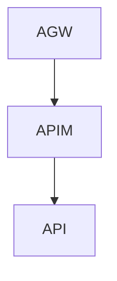

### Debug your APIs using request tracing
```powershell
#https://learn.microsoft.com/en-us/azure/api-management/api-management-howto-api-inspector
$Token = az account get-access-token --query accessToken --output tsv
$URL = " https://management.azure.com//subscriptions/xyz/resourceGroups/rg-apim-dev-01/providers/Microsoft.ApiManagement/service/apim-dev-01/gateways/managed/listDebugCredentials?api-version=2023-05-01-preview"
$headers = @{
    "Authorization" = "Bearer $Token"
    "Content-type"  = "application/json"
}
$body = @{
    apiId    = "/subscriptions/xyz/resourceGroups/rg-apim-dev-01/providers/Microsoft.ApiManagement/service/apim-dev-01/apis/my-api"
    purposes = @("tracing")
}
(Invoke-RestMethod -Method POST -URI $URL -Headers $headers -Body $body) | ConvertTo-Json

```

In APIM add header
`Apim-Debug-Authorization: "aid=..."`
### Export open api documentation
`/subscriptions/xyz/resourceGroups/rg-apim-dev-01/providers/Microsoft.ApiManagement/service/apim-dev-01/apis/bolagsverket-api?export=true&format=openapi&api-version=2023-05-01-preview`
