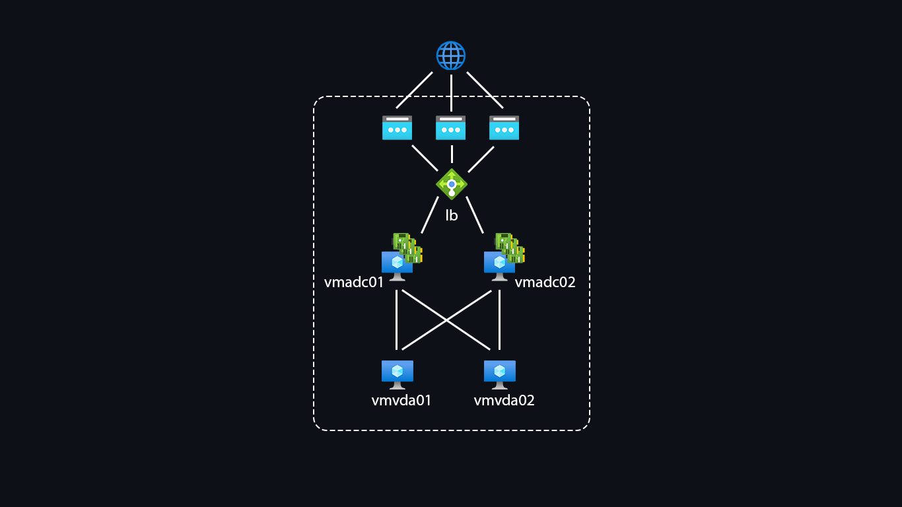

### A pair of Citrix ADC VPX instances with multiple NICs in an active-passive high availability (HA) setup on Azure

[Configure a high-availability setup with multiple IP addresses and NICs](https://docs.citrix.com/en-us/citrix-adc/current-release/deploying-vpx/deploy-vpx-on-azure/configure-vpx-pair-ha-inc.html)

