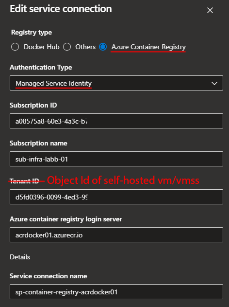

# Deploy infrastructure (bicep folder)
- Deploy Azure Container Registry
- Deploy Azure Container Apps Environment

# Create DevOps Service Connection for Azure Container Registry using Managed Identity
- Go to DevOps
- Create service connection > Docker Registry 
- Under Tenant ID, put Object Id of self-hosted vm/vmss
- Assign self-hosted vm/vmss AcrPull/AcrPush/AcrImageSigner (included in main.bicep)



# Set up a pipline to push an image (docker-pipeline folder)
- Use self-hosted agent
- Build an application in c# (csharp folder)
- Publish application to container registry
```yaml
trigger:
- main

variables:
  dockerRegistryServiceConnection: 'sp-acrxxx'
  imageRepository: 'c-sharp-web'
  dockerfilePath: '$(Build.SourcesDirectory)/containerapp01/containerapp01/Dockerfile'
  tag: '$(Build.BuildId)'

stages:
- stage: Build
  displayName: Build and publish stage
  jobs:
  - job: Build
    displayName: Build job
    pool:
      name: 'vmss-infra-devops-dev-we-01'
    steps:
    - task: DockerInstaller@0
      # inputs:
      #   dockerVersion: '17.09.0-ce'

    - task: Docker@2
      displayName: Build and publish image to Azure Container Registry
      inputs:
        command: buildAndPush
        containerRegistry: $(dockerRegistryServiceConnection)
        repository: $(imageRepository)
        dockerfile: $(dockerfilePath)
        tags: |
          $(tag)
```

# Deploy infrastructure (bicep folder)
- Deploy Azure Container Apps