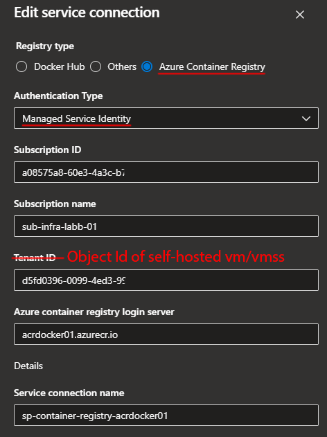

# Deploy infrastructure (bicep folder)
- Deploy vm for devops agent pool (vmdevops01)
- Deploy vm for docker (vmdocker01)
- Deploy azure container registry

# Create Devops agent pool and add an agent (vmdevops01)
```shell
sudo curl -O https://vstsagentpackage.azureedge.net/agent/3.234.0/vsts-agent-linux-x64-3.234.0.tar.gz
mkdir devopsagent
cd devopsagent
tar zxvf ../vsts-agent-linux-x64-3.234.0.tar.gz
./config.sh --unattende --url https://dev.azure.com/myorg --auth pat --token dtbq3znsztjlqto3x3mptktg3rm2p3ccdyj7zyz7rqzpj7nlqyi --pool vmlabb --agent vmdocker01 --acceptTeeEula --work _work
sudo ./svc.sh install
sudo ./svc.sh start
```
# Create DevOps Service Connection for Azure Container Registry using Managed Identity
- Go to DevOps
- Create service connection > Docker Registry 
- Under Tenant ID, put Object Id of self-hosted vm/vmss
- Assign self-hosted vm/vmss AcrPull/AcrPush/AcrImageSigner (included in main.bicep)




# Set up a pipline to push an image (docker-pipeline folder)
- docker must run as a non-root user (included in vm.bicep) [Manage Docker as a non-root user](https://docs.docker.com/engine/install/linux-postinstall/#manage-docker-as-a-non-root-user)
```yaml
pool:
  name: vmlabb
  ##demands: Agent.Name -equals vmmgmtdev01

steps:
- task: Docker@2
  displayName: Login to ACR
  inputs:
    command: login
    containerRegistry: sp-container-registry-acrdocker01
- task: Docker@2
  inputs:
    command: 'buildAndPush'
    repository: nginx01
    ockerfile: '$(Build.Repository.LocalPath)/docker-pipeline/Dockerfile'    
    tags: |
          1.002
          1.001
```

# Pull image from ACR using admin account(access key)
- Login to vmdocker01 using SSH
- login to azure container registry using password and pull the image
```shell
sudo docker login -u acrdockerdev01 -p I5vCNwCSgF2eBWFcXP4ZQpMcO2eoGyzJNM0MODOhTU+ACRA0idzt acrdockerdev01.azurecr.io
sudo docker pull acrdockerdev01.azurecr.io/system/nginx01:1.002
sudo docker image ls
```

# Run container 1 permanenlty
`sudo docker run --name docker-nginx -p 80:80 -d e0f0f1bfc377`
# Run container 2 permanenlty
`sudo docker run --name docker-nginx-2 -p 81:80 -d e0f0f1bfc377`
# Check containers status
`docker ps`
# Stop container
`sudo docker container stop a7d6534857f2`
# Remove container
`sudo docker container rm a7d6534857f2`