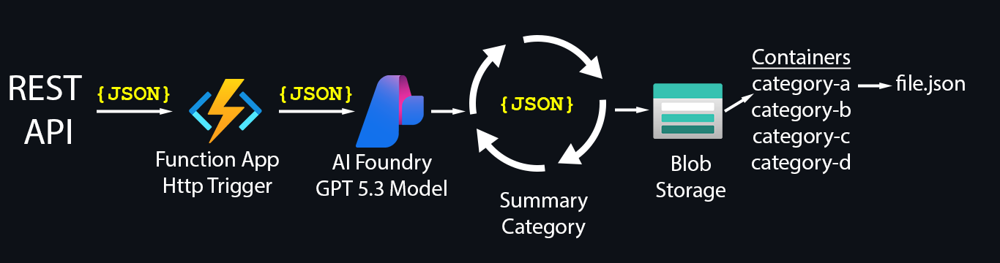

## API Call To Function App
```powershell

$body = @{
    "tags"      = @{
        "ip"         = "10.203.8.18"
        "key"        = "vfs.fs.size[H:,pused]"
        "host"       = "VMSQLTEST08"
        "value"      = "92.18 %"
        "trigger"    = "H:: Disk space is critically low (used > 90%)"
        "severity"   = "Average"
        "trigger_id" = "34571"
    }
    "state"     = "PROBLEM"
    "title"     = "[ABCD] H:: Disk space is critically low (used > 90%) VMSQLTEST08"
    "message"   = "Two conditions should match: First, space utilization should be above 90.\n Second condition should be one of the following:\n - The disk free space is less than 5G.\n - The disk will be full in less than 24 hours. vfs.fs.size[H:,pused] 92.18 %"
    "alert_uid" = "4518912"
} | ConvertTo-Json

Invoke-RestMethod -Uri "https://func-aif-dev-01.azurewebsites.net/api/summarize-json" -Headers $headers -Method Post -Body $body
```

## Custom spans in Application Insights
#### Spans let you measure exactly what part of your function is slow or failing.
#### Application Insights > Investigate > Search > blob_upload
#### Or Log Analytics Query
```csl
dependencies
| where name == "blob_upload"
| order by timestamp desc
```
```python
from opentelemetry import trace
tracer = trace.get_tracer(__name__)
with tracer.start_as_current_span("blob_upload") as span:
    span.set_attribute("blob.container", category)
    span.set_attribute("blob.name", f"{alert_name}_{now_formated}.json")
    span.set_attribute("blob.url", f"{url}")
    span.set_attribute("blob.method", "PUT")

    response = requests.put(
        url, headers=headers, data=file_content.encode("utf-8")
    )

    span.set_attribute("blob.reason", f"{response.reason}")
    span.set_attribute("blob.status_code", response.status_code)
    span.set_attribute("blob.success", response.ok)
```

## Custom metrics in Application Insights
#### You can define metrics like: Messages processed, Blob failures, Processing time
#### Application Insights > Monitoring > Metrics > Metric namespace > Custom > Metric > messages_processed
#### Or Log Analytics Query
```csl
customMetrics
| where name == "messages_processed"
| order by timestamp desc
```
```python
from opentelemetry.metrics import get_meter
meter = get_meter(__name__)
summaries_counter = meter.create_counter(
    "summaries_processed",
    unit="1",
    description="Number of JSON summaries processed",
)

summary_latency = meter.create_histogram(
    "summary_latency_ms",
    unit="ms",
    description="Time spent summarizing JSON payloads",
)
summaries_counter.add(
    1,
    {
        "category": category,
        "route": "summarize-json",
    },
)

summary_latency.record(
    duration_ms,
    {
        "category": category,
    },
)
```

## Deploy function
```powershell
func templates list

func new --template "HTTP trigger" --name summarize-json --authlevel anonymous

pip install -r requirements.txt

func start

func azure functionapp publish func-aif-dev-01 --force
```