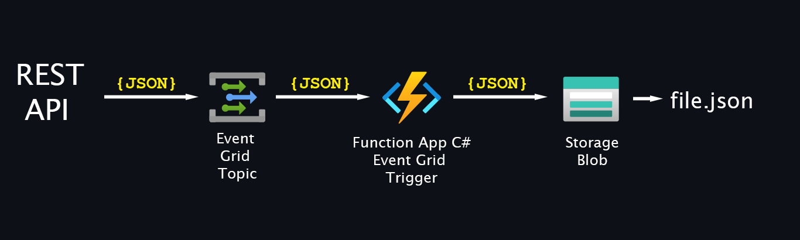

### Upload released-package.zip to container func01

### HTTP Call to Event Grid
```powershell
$URL = "https://evgt-sys-dev-01.swedencentral-1.eventgrid.azure.net/api/events"
$headers = @{
    "aeg-sas-key" = "2sOldDf3Wsd7Q9kMW1Nn9HmI1g7iK1vmwh3NBXGZia58ot9nQLgOJQQJ99BAACfhMk5XJ3w3AAABAZEGBhy8"
}
$Body = ConvertTo-Json @{
    id          = Get-Random 99999
    eventType   = "Microsoft.EventGrid.SubscriptionValidationEvent"
    subject     = "api/secret"
    eventTime   = Get-Date -Format s
    topic       = "/subscriptions/1234abc8-ab53-409c-b613-1234f13f6470/resourceGroups/rg-func-eventgrid-dev-01/providers/Microsoft.EventGrid/topics/evgt-sys-dev-01"
    data        = @{
        displayName    = "user_test"
        enabled        = "true"
        validationCode = "512d38b6-c7b8-40c8-89fe-f46f9e9622b6"
    }
    dataVersion = "1.0"
}
Invoke-RestMethod -Method POST -URI $URL -Headers $headers -Body [$Body]
```
### Code
```cs
using Azure.Identity;
using Azure.Storage.Blobs;
using Microsoft.AspNetCore.Http;
using Microsoft.Azure.Functions.Worker;
using Microsoft.Extensions.Logging;
using Newtonsoft.Json;

namespace EventGrid
{
    public class Function1
    {
        private readonly ILogger<Function1> _logger;

        public Function1(ILogger<Function1> logger)
        {
            _logger = logger;
        }

        [Function("Create_Blobs")]
        public async Task Run([EventGridTrigger] string cloudEvent)
        {
            _logger.LogWarning("JSON: " + cloudEvent.ToString());

            dynamic? response = JsonConvert.DeserializeObject(cloudEvent);
            string? subject = response?.subject;
            string? eventType = response?.eventType;
            object? data = response?.data;
            string? topic = response?.topic;
            string? id = response?.id;
            string? dataVersion = response?.dataVersion;
            string? metadataVersion = response?.metadataVersion;
            string? eventTime = response?.eventTime;

            _logger.LogWarning("subject: " + subject);
            _logger.LogWarning("eventType: " + eventType);
            _logger.LogWarning("data: " + data);
            _logger.LogWarning("topic: " + topic);
            _logger.LogWarning("id: " + id);
            _logger.LogWarning("dataVersion: " + dataVersion);
            _logger.LogWarning("metadataVersion: " + metadataVersion);
            _logger.LogWarning("eventTime: " + eventTime);

            _logger.LogWarning("Uploading data ... ");

            var blobServiceClient = new BlobServiceClient(
                    new Uri($"https://stfunceventgriddev01.blob.core.windows.net"),
                    new ManagedIdentityCredential());
            // Create a blob container if it doesn't exist
            var containerClient = blobServiceClient.GetBlobContainerClient("eventgrid-results");

            var blobClient = containerClient.GetBlobClient($"eventgrid-{DateTime.Now.ToString("yyyy-MM-dd-HH-mm-ss")}.json");

            if (data != null)
            {
                var upload = await blobClient.UploadAsync(BinaryData.FromString(data?.ToString()), overwrite: true);
                _logger.LogWarning("Upload Status: " + upload.GetRawResponse().Status);
            }
            else
            {
                _logger.LogWarning("The data is empty.");
            }

        }

        [Function("Create_Blobs_For_Testing")]
        public async Task RunX([HttpTrigger(AuthorizationLevel.Anonymous, "get", "post")] HttpRequest req)
        {
            string requestBody = await new StreamReader(req.Body).ReadToEndAsync();
            _logger.LogWarning("JSON: " + requestBody);

            dynamic? response = JsonConvert.DeserializeObject(requestBody);
            string? subject = response?.subject;
            string? eventType = response?.eventType;
            object? data = response?.data ;
            string? topic = response?.topic;
            string? id = response?.id;
            string? dataVersion = response?.dataVersion;
            string? metadataVersion = response?.metadataVersion;
            string? eventTime = response?.eventTime;

            _logger.LogWarning("subject: " + subject);
            _logger.LogWarning("eventType: " + eventType);
            _logger.LogWarning("data: " + data);
            _logger.LogWarning("topic: " + topic);
            _logger.LogWarning("id: " + id);
            _logger.LogWarning("dataVersion: " + dataVersion);
            _logger.LogWarning("metadataVersion: " + metadataVersion);
            _logger.LogWarning("eventTime: " + eventTime);

            _logger.LogWarning("Uploading data ... ");

            var blobServiceClient = new BlobServiceClient(
                    new Uri($"https://stfunceventgriddev01.blob.core.windows.net"),
                    new  DefaultAzureCredential());
            // Create a blob container if it doesn't exist
            var containerClient = blobServiceClient.GetBlobContainerClient("eventgrid-results");

            var blobClient = containerClient.GetBlobClient($"eventgrid-{DateTime.Now.ToString("yyyy-MM-dd-HH-mm-ss")}.json");
            if (data != null)
            {
                var upload = await blobClient.UploadAsync(BinaryData.FromString(data?.ToString()), overwrite: true);
                _logger.LogWarning("Upload Status: " + upload.GetRawResponse().Status);
            }
            else 
            { 
                _logger.LogWarning("The data is empty.");
            }
        }
    }
}
```