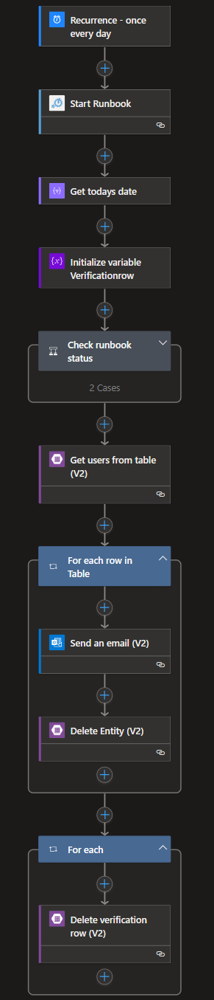

## AD user password expiration notification

### This logic app checks if AD user passoword expires and sends an email to users.

Before deployment create app registration in Azure AD and put client id and secret to param.json

Give app registration contributor access to manage automation account

Deploy bicep template

Authorize office365 connection

In AdPasswordExpiration.ps1 put storage account name, table name and sas token.

Put AdPasswordExpiration.ps1 on a management server under C:/B3

