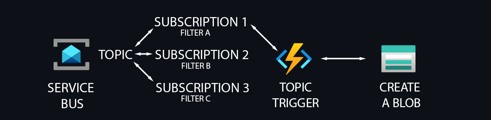

## API Call To Service Bus
```powershell
$token = az account get-access-token --resource https://servicebus.azure.net/ --query accessToken -o tsv
$headers = @{
    #'Authorization' = 'SharedAccessSignature sr=sb-system-dev-01.servicebus.windows.net&sig=blabla%3d&se=1772591944&skn=RootManageSharedAccessKey'
    'Authorization' = "Bearer $token"
    'Content-Type'  = 'application/json'
    # 'weekday' = (Get-Date).ToString("dddd")
    "month" = (Get-Date).ToString("MMMM")
}

$body = @{
    "id"       = [Guid]::NewGuid().ToString()
    "message"  = "Hello, Service Bus!"
    "datetime" = (Get-Date).ToString("o")
    "weekday" = (Get-Date).ToString("dddd")
    "month" = (Get-Date).ToString("MMMM")
    "properties" = @{
        "customProperty1" = "value1"
        "customProperty2" = "value2"
    }
} | ConvertTo-Json

Invoke-RestMethod -Uri "https://sb-system-dev-01.servicebus.windows.net/sbt-logic/messages?timeout=60" -Headers $headers -Method Post -Body $body
```

## Custom spans in Application Insights
#### Spans let you measure exactly what part of your function is slow or failing.
#### Application Insights > Investigate > Search > blob_upload
#### Or Log Analytics Query
```csl
dependencies
| where name == "blob_upload"
| order by timestamp desc
```
```python
from opentelemetry import trace
tracer = trace.get_tracer(__name__)
with tracer.start_as_current_span("blob_upload") as span:
        span.set_attribute("blob.container", "container01")
        span.set_attribute("blob.name", f"recieved_{now_formated}_{id}.json")
        span.set_attribute("http.method", "PUT")
        span.set_attribute("http.url", url)

        response = requests.put(
            url, headers=headers, data=file_content.encode("utf-8")
        )

        span.set_attribute("http.status_code", response.status_code)
        span.set_attribute("blob.success", response.ok)
        logging.info(f"BLOB CREATED: {response.ok}")
```

## Custom metrics in Application Insights
#### You can define metrics like: Messages processed, Blob failures, Processing time
#### Application Insights > Monitoring > Metrics > Metric namespace > Custom > Metric > messages_processed
#### Or Log Analytics Query
```csl
customMetrics
| where name == "messages_processed"
| order by timestamp desc
```
```python
from opentelemetry.metrics import get_meter
meter = get_meter(__name__)
processed_counter = meter.create_counter(
    "messages_processed",
    unit="1",
    description="Number of Service Bus messages processed",
)
processed_counter.add(
        1,
        {
            "topic": os.environ.get("TOPIC_NAME", ""),
            "subscription": os.environ.get("SUBSCRIPTION_NAME", ""),
        },
    )
```

## Deploy function
```powershell
func templates list

func new --template "Azure Service Bus Topic trigger" --name servicebus_topic_trigger_to_blob --authlevel anonymous

pip install -r requirements.txt

func start

func azure functionapp publish func-sb-topic-dev-01 --force
```

## Generate SharedAccessSignature(SAS) 
```powershell
[Reflection.Assembly]::LoadWithPartialName("System.Web") | Out-Null
$Namespace = "sb-system-dev-01.servicebus.windows.net"
$AccessPolicyName = "RootManageSharedAccessKey"
$AccessPolicyKey = "bla/bla/dI="
$Expires = ([DateTimeOffset]::Now.ToUnixTimeSeconds()) + 31536000
$SignatureString = [System.Web.HttpUtility]::UrlEncode($Namespace) + "`n" + [string]$Expires
$HMAC = New-Object System.Security.Cryptography.HMACSHA256
$HMAC.Key = [Text.Encoding]::ASCII.GetBytes($AccessPolicyKey)
$Signature = $HMAC.ComputeHash([Text.Encoding]::ASCII.GetBytes($SignatureString))
$Signature = [Convert]::ToBase64String($Signature)
$SASToken = "SharedAccessSignature sr=" + [System.Web.HttpUtility]::UrlEncode($Namespace) + "&sig=" + [System.Web.HttpUtility]::UrlEncode($Signature) + "&se=" + $Expires + "&skn=" + $AccessPolicyName
$SASToken

```
