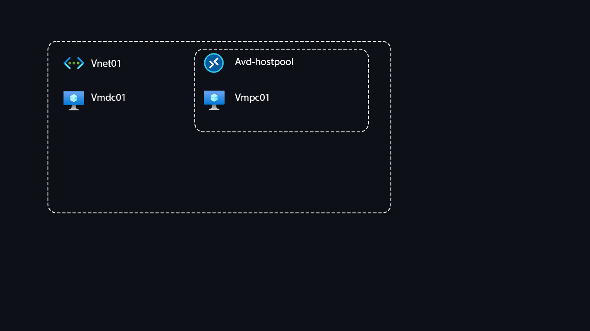

### Azure Virtual Desktop - Host Pool, App Groups, Workspace.

To add vmpc01 to the host pool you have to install manually on client virtual machine:
- Azure Virtual Desktop Agent - Microsoft.RDInfra.RDAgent.Installer.msi
- Azure Virtual Desktop Agent Bootloader - Microsoft.RDInfra.RDAgentBootLoader.Installer-x64.msi

[Register the virtual machines to the Azure Virtual Desktop host pool](https://docs.microsoft.com/en-us/azure/virtual-desktop/create-host-pools-powershell?tabs=azure-powershell#register-the-virtual-machines-to-the-azure-virtual-desktop-host-pool)

If you want to connect to AVD client, you need to buy a domain. Azure AD DC doesn't require registered domain.

