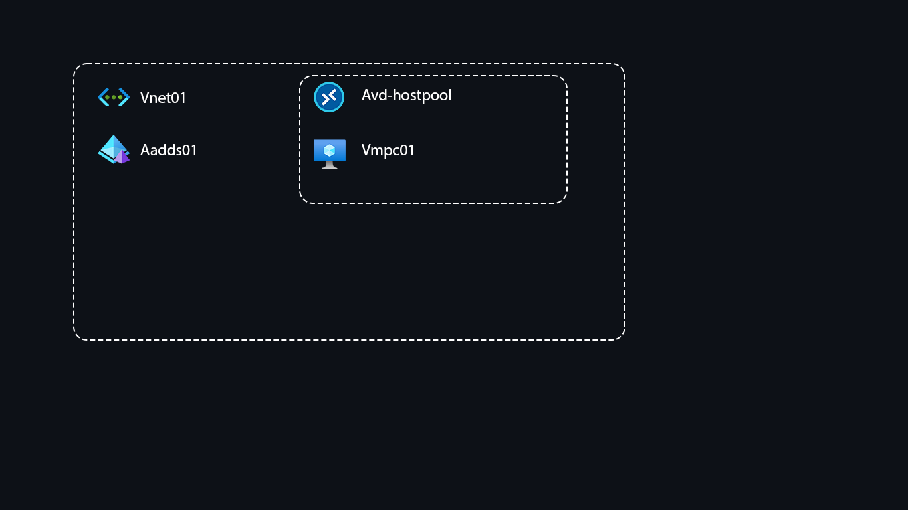

# Azure Virtual Desktop with Azure AD Domain Services

## Azure Virtual Desktop - Host Pool, App Groups, Workspace.

If you want to try the setup, do these steps manually:

- Add Azure AD admin user to ADD DC Administrators group 

- Join vm client to Azure AD DC - reset the admin password if you get "referenced account is currently locked out"

- Install on client: Azure Virtual Desktop Agent - [LINK](https://docs.microsoft.com/en-us/azure/virtual-desktop/create-host-pools-powershell?tabs=azure-powershell#register-the-virtual-machines-to-the-azure-virtual-desktop-host-pool)

- Install on client: Azure Virtual Desktop Agent Bootloader - [LINK](https://docs.microsoft.com/en-us/azure/virtual-desktop/create-host-pools-powershell?tabs=azure-powershell#register-the-virtual-machines-to-the-azure-virtual-desktop-host-pool)

- Add a new AD user to connect to AVD

- Add the user to Application group assignments

- Log in to AVD with with link: https://client.wvd.microsoft.com/arm/webclient/index.html

- Or install AVD application from [here](https://docs.microsoft.com/en-us/windows-server/remote/remote-desktop-services/clients/remote-desktop-clients).

