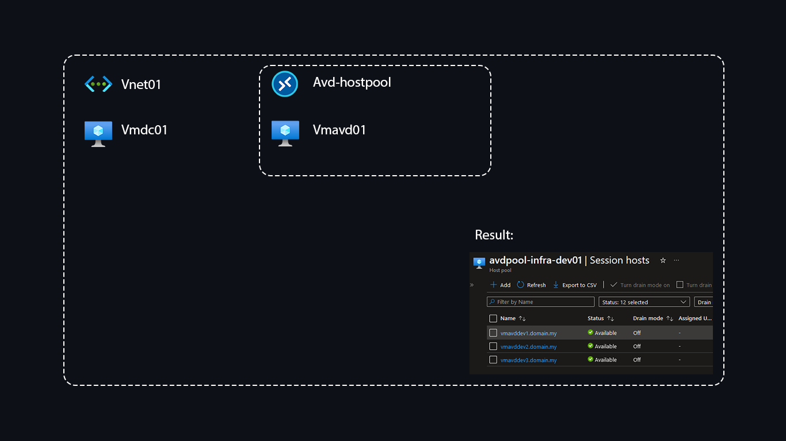

## Azure Virtual Desktop with automatic Windows Domain Join and Hostpool enrollment.

If you want to try the setup, use Azure AD Domain Services instead:

- Add Azure AD admin user to ADD DC Administrators group 

- Add a new AD user to connect to AVD

- Add the user to Application group assignments

- Add the user as Virtual Machine User Login in subscription

- Log in to AVD with the link: https://client.wvd.microsoft.com/arm/webclient/index.html

- Or install AVD application from [here](https://docs.microsoft.com/en-us/windows-server/remote/remote-desktop-services/clients/remote-desktop-clients).

- [Azure Virtual Desktop Experience Estimator](https://azure.microsoft.com/en-us/products/virtual-desktop/assessment/#estimation-tool)

- [Required URLs for Azure Virtual Desktop](https://learn.microsoft.com/en-us/azure/virtual-desktop/safe-url-list?tabs=azure)

